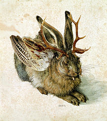

= The Dangerous and Thrilling Documentation Chronicles
Kismet Chameleon; Lazarus het_Draeke <lazar@asciidoctor.org>
1.0: The first incarnation of {doctitle} 
:description: This story chronicles the inexplicable hazards and vicious beasts a +
team must surmount and vanquish on the journey to finding their open source +
project's true power.
:toc:
:source-highlighter: coderay
:icons: font
:wolper: http://en.wikipedia.org/wiki/Wolpertinger

{description}

== A City Under Siege

This journey begins one late Monday afternoon at http://www.devoxx.be/#/[Devoxx].
Our team desperately needs coffee, but none of us dare open the theater doors.

To leave means *code dismemberment and certain death*.

During the first conference workshop, a script-addicted warlock released a plague of Wolpertingers.

[.left.text-center]

You may not be familiar with these {wolper}[ravenous beasts], but, trust us, they'll eat your shorts and suck the loops from your code.
Since then, we'd been searching for the security crew's defensive operations manual.
But we couldn't find it, and those DefOps werewolves still hadn't returned from their trust building retreat at Beer Central.
They'd left last night.
Either they'd eaten each other, or they'd fallen victim to the Wolpertingers roaming the city streets.

_Weak light from the hallway trickled across the theater, chased by a distant scream._

WARNING: Working with werewolves leads to howling and trying to train aggressive regular expressions with Pavlovian reinforcement.

== The Ravages of Writing

Crystalline XML tags relentlessly bombarded the theater.

.XML tags
[source,xml]
----
<author>
  <personname>
    <firstname>Lazarus</firstname>
    <surname>het Draeke</surname>
  </personname>
  <affiliation>
    <jobtitle>Word SWAT Team Leader</jobtitle>
  </affiliation>
</author>
----

=== A Recipe for Potion

* Two fresh Burdockian leaves
** They must be harvested by the light of the teal moons.

==== Searching for Burdockian

Crawling through the twisted understory of the Hackergarten...

== Dawn on the Plateau

Hanging from...

